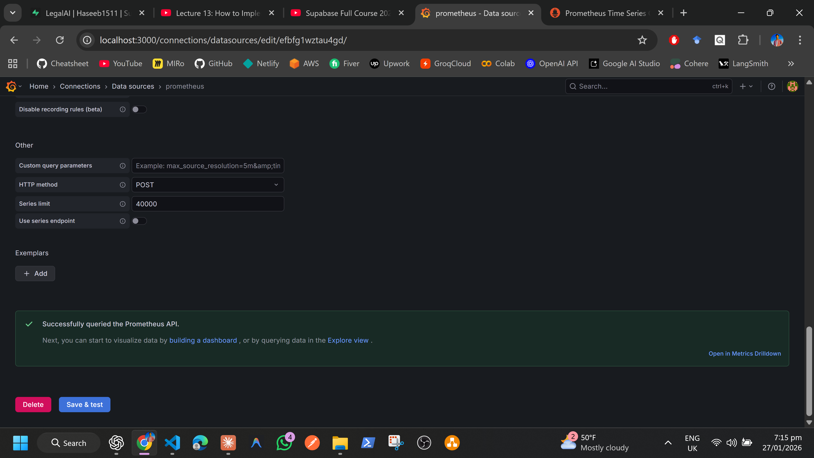
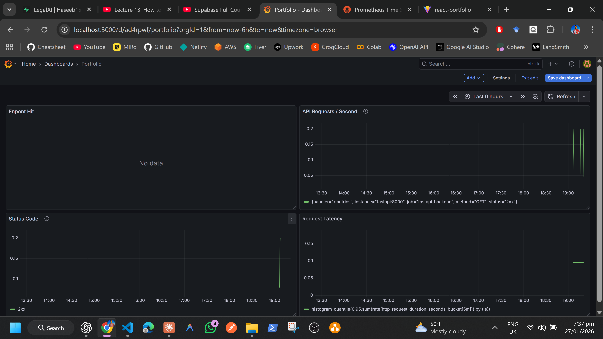

# In Development  yet


```bash
┌──────────┐      ┌────────────┐
│ React    │ ---> │ FastAPI    │
│ Frontend │      │ (Docker)   │
└──────────┘      │  /metrics  │
                  └─────┬──────┘
                        │
                ┌───────▼────────┐
                │ Prometheus      │
                │ (scrapes metrics│
                └───────┬────────┘
                        │
                ┌───────▼────────┐
                │ Grafana         │
                │ (visualization) │
                └────────────────┘


```
# How to run

# backend
```bash
# run without docker
uv run uvicorn chatbot_rag.backend.app:app --reload

# docker build image(or rebuild)
docker build -t fastapi-backend -f backend/Docker.fastapi backend

# to run
docker run -p 8000:8000 fastapi-backend
#to run with .env
docker run -p 8000:8000 --env-file .env fastapi-backend

#local
http://localhost:8000

```

# frontend
```bash
npm install lucide-react  # to install lucid

cd portfolio
npm install      # only needed first time

npm run dev  # run from root directer no need for cd frontend

#to start from root directery
npm --prefix portfolio start
```


# run both togehterh
concurrently "uvicorn chatbot.app:app --reload --host 127.0.0.1 --port 8000" "npm --prefix portfolio start"


# Grafan local

### Grafan Visualization



# add Blogs page
# Academic Profile
