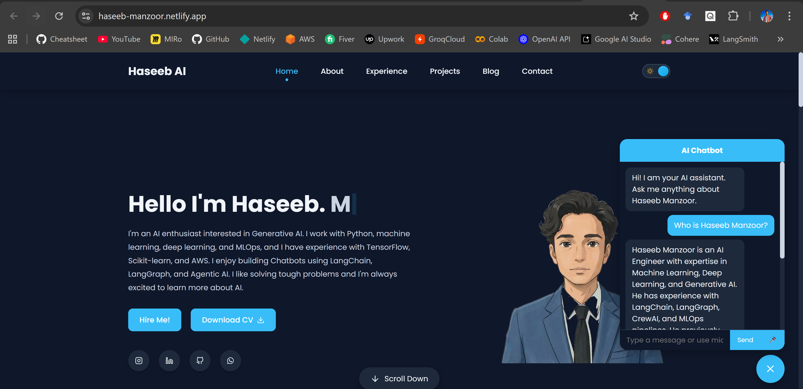
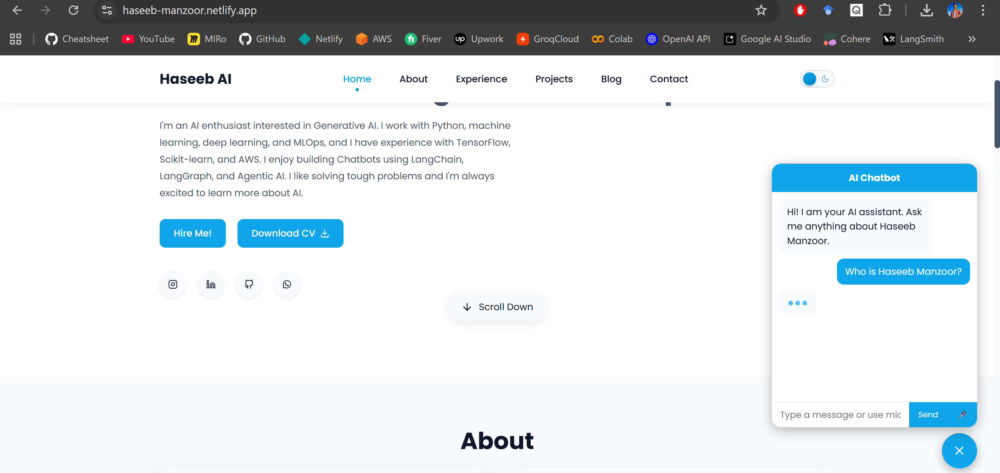
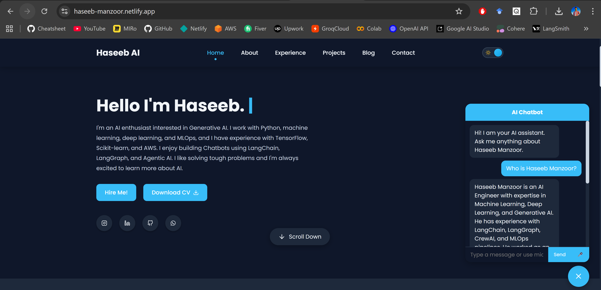

# In Development  yet

## Portfolio

Check out my portfolio website: [Haseeb Manzoor Portfolio](https://haseeb-manzoor.netlify.app/)

## Features
1. **Chatbot**
2. **Backend FastAPI**
3. **Frontend React**
4. **Database Postgre(supabase)**


## Port folio


<!--  -->

# How to run
# backend
```bash

# Build docker image first
docker build -t fastapi-backend -f backend/Dockerfile .

# then run it 
docker run -p 8000:8000 fastapi-backend

#to run with .env
docker run -p 8000:8000 --env-file .env fastapi-backend

```


# frontend
```bash
npm install lucide-react  # to install lucid
npm install react-markdown  # to install markdown

npm install      # only needed first time

# can be run from root directery
npm run dev  # run from root directer no need for cd frontend

#to start from root directery
npm --prefix portfolio start
```


### Grafan and Prometeus
``Only tested in local not in produciton``
```bash
┌──────────┐      ┌────────────┐
│ React    │ ---> │ FastAPI    │
│ Frontend │      │ (Docker)   │
└──────────┘      │  /metrics  │
                  └─────┬──────┘
                        │
                ┌───────▼────────┐
                │ Prometheus      │
                │ (scrapes metrics│
                └───────┬────────┘
                        │
                ┌───────▼────────┐
                │ Grafana         │
                │ (visualization) │
                └────────────────┘


```


# Grafan local

### Grafan Visualization


